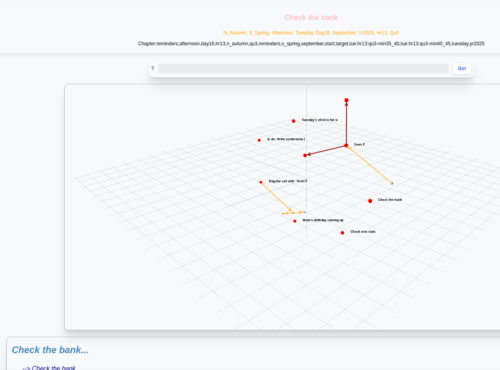
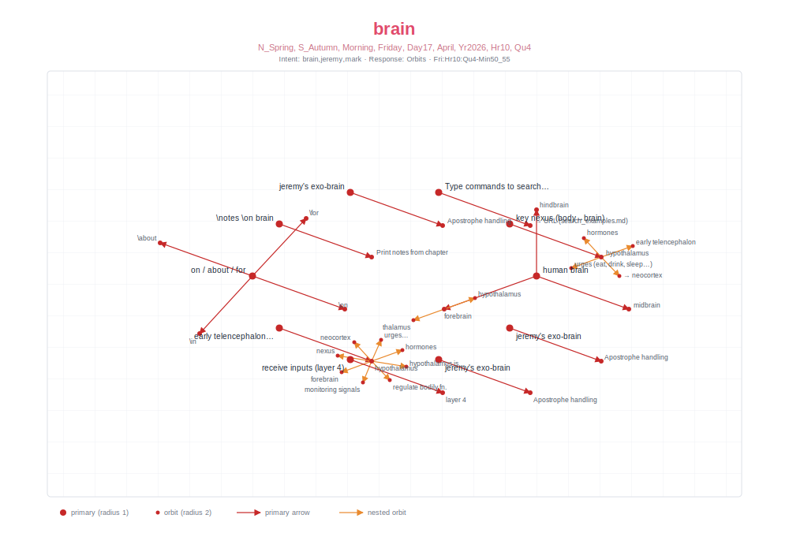

# Trying to build an MCP to SST proxy

There are conflicting versions, muddled together by LLM online, but this finally compiles

<pre>
git clone https://github.com/markburgess/MCP-SST
cd MCP-SST
make
</pre>

This should build

The server needs to be run from the same bin directory as the SSTorytime
<pre>
  bin/http_server
</pre>
else specify the self-signed certificate file with
<pre>
bin/main -cert path/to/cert.pem

</pre>

## What the MCP server enables

Once the server is advertising `N4Lquery` on `tools/list`, an LLM
client like Claude Code can drive the SSTorytime knowledge graph in
natural language — no hand-crafted JSON-RPC needed.

### Example: rendering the word "brain"

> **Prompt:** *"Run an N4L query for the word 'brain', then generate
> an SVG of the coordinates that come out of it. Use the SSTorytime
> web UI screenshot as style inspiration."*

Style reference — a screenshot of SSTorytime's own web UI (copied
from
[`SSTorytime/docs/figs/reminder.png`](https://github.com/markburgess/SSTorytime/blob/main/docs/figs/reminder.png)):

The tool returns the orbit structure as JSON — primary nodes plus
their radius-1 and radius-2 satellites, each with an `XYZ` position.
The model lays that data out in the same idiom:

Red dots are primary nodes; red arrows are radius-1 relations
(`human brain → forebrain`); orange arrows are nested radius-2
relations (`forebrain → hypothalamus`). The whole picture — query,
layout, styling — is produced by the LLM from a single MCP tool
call.
